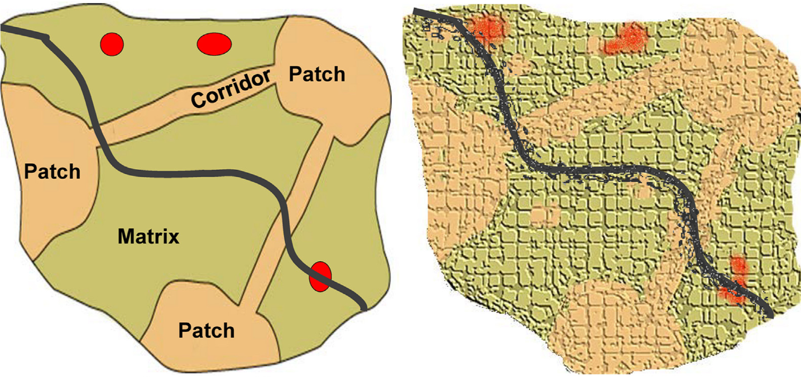
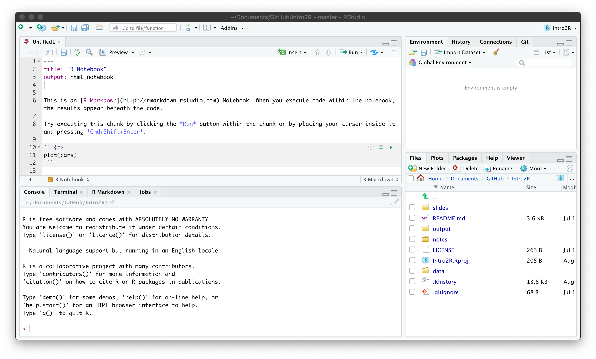
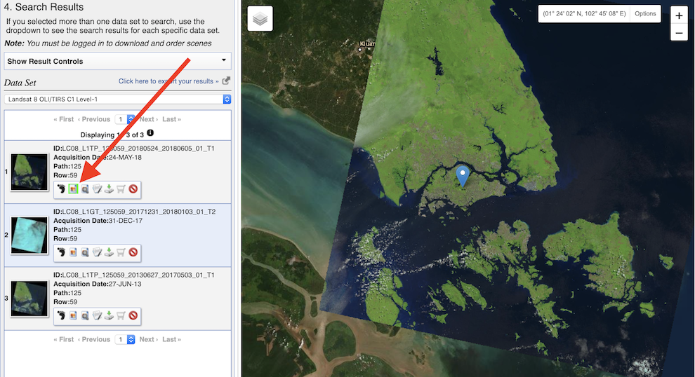
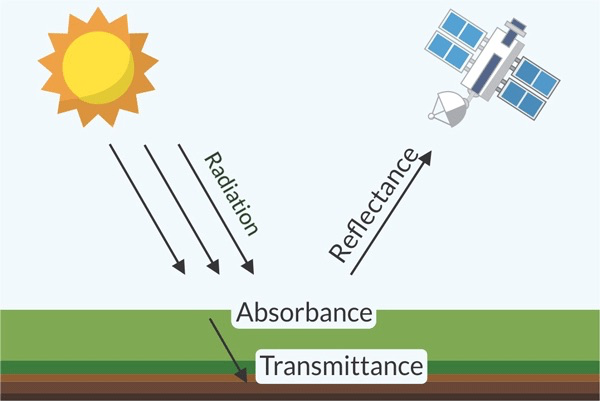
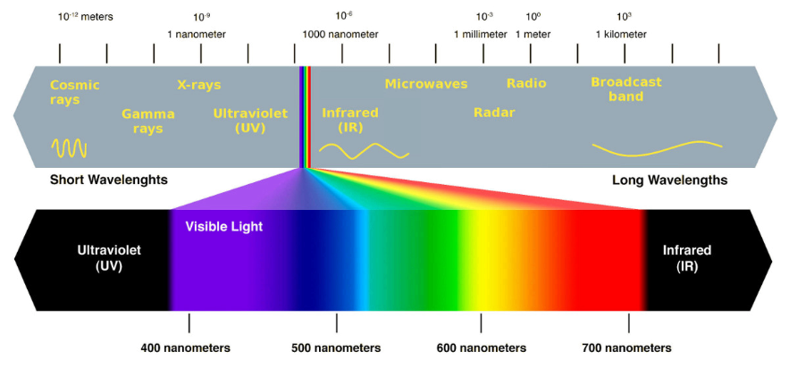
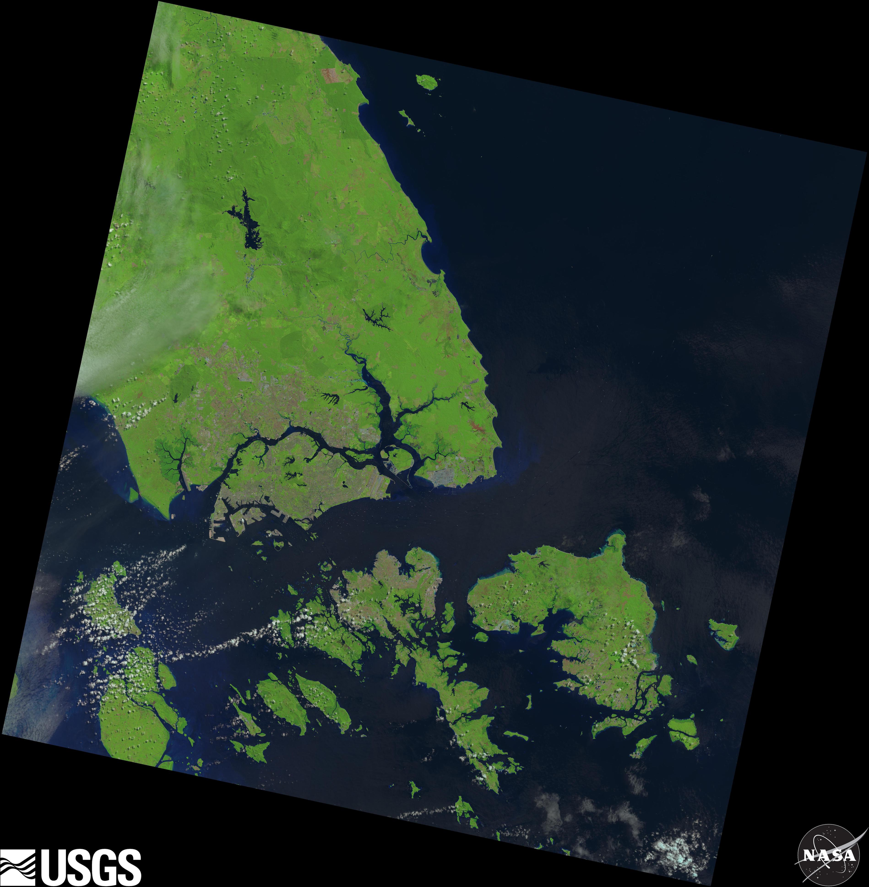
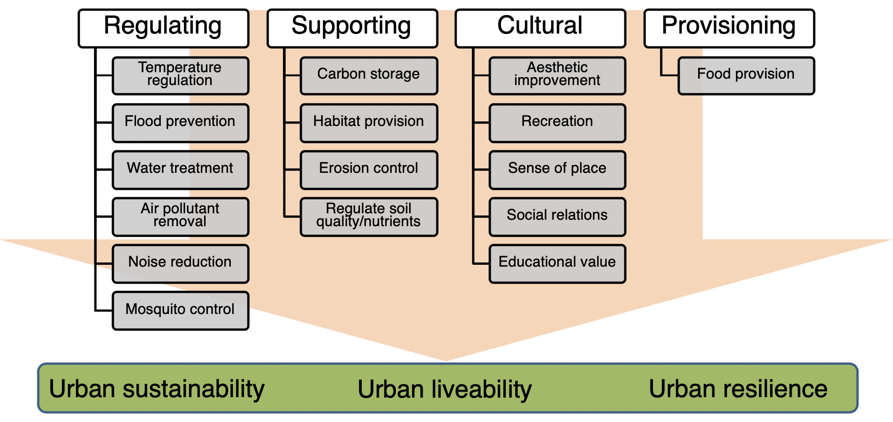

class: inverse, center, middle

```{r export slides to pdf, include = FALSE, eval = FALSE}
pagedown::chrome_print('https://github.com/xp-song/Intro2R-spatial/slides/1_Intro2R-spatial_slides.html')
```


# Intro2R-spatial

<br>

1. Navigate to course webpage for instructions and background information  
*https://github.com/xp-song/Intro2R-spatial*  

2. [Download](https://github.com/xp-song/Intro2R-spatial/archive/master.zip) workshop materials  
*(green button on webpage)*

---

class: inverse, center, middle
name: why

# Outline  
 
__[Why analyse spatial patterns?](#why)__  

[Landscape ecology: Conceptual models](#concepts)

[Recap: R Environment](#renviron)  

[Land cover classification](#classify)  

[Landscape metrics](#lsm)  

[Useful resources](#resources)  

???
- First off, I will explain what I mean by spatial patterns
- Recap on the basics of R
- Get into the analysis

---
class: left
background-image: url("images/sg_urech2017.jpg")
background-position: center
background-size: cover

# Spatial pattern of a landscape

### A function of the *__composition__* and *configuration* of the physical landscape

<br><br><br><br><br><br><br><br><br><br><br><br><br><br>  
.right[.small[
<span style="color:white">Photo: Philipp Urech (2017)</span>
]]

???
- What is this landscape composed (consist) of?

---
class: left
background-image: url("images/sg_urech2017.jpg")
background-position: center
background-size: cover

# Spatial pattern of a landscape

### **Spatial composition**
- Variety - What types/classes?
- Abundance - How much?

<br><br><br><br><br><br><br><br><br><br><br><br><br>  
.right[.small[
<span style="color:white">Photo: Philipp Urech (2017)</span>
]]

???
- E.g. Basic type of classification: as green, blue, grey
- Abundance: Absolute (i.e. total area) or relative (%)

---

class: left
background-image: url("images/sg_urech2017.jpg")
background-position: center
background-size: cover

# Spatial pattern of a landscape

### A function of the *composition* and *__configuration__* of the physical landscape

<br><br><br><br><br><br><br><br><br><br><br><br><br><br>  
.right[.small[
<span style="color:white">Photo: Philipp Urech (2017)</span>
]]

???
- Quantifying this is more complex
- What are some examples of configuration?

---
class: left
background-image: url("images/sg_urech2017.jpg")
background-position: center
background-size: cover

# Spatial pattern of a landscape

### **Spatial configuration**
- Position
- Orientation
- Shape/arrangement

<br><br><br><br><br><br><br><br><br><br><br><br>  
.right[.small[
<span style="color:white">Photo: Philipp Urech (2017)</span>
]]

???
What if...
1. All greenery was on the left... buildings/roads on the right?
2. Greenery finely interspersed/intertwined with the grey cover?


- Focusing on configuration is where the idea of "connectivity" becomes relevant
  - Connectivity for... Wind, biodiverisity, recreation (e.g. cycling networks)

---

class: left

# Why is spatial pattern important?

### The study of landscape ecology  

<sup> </sup>

```{r diagram, echo = FALSE, fig.align = "center"}
library(DiagrammeR)
m <- mermaid("graph TB;
		   A(Spatial Patterns) --> B(Ecological Processes);
		   B(Ecological Processes)--> A(Spatial Patterns);
		   B(Ecological Processes) --> C(City Sustainability/Liveability/Resilience);
		   C(City Sustainability/Liveability/Resilience) --> D(Human Well-being);
		   ")
widgetframe::frameWidget(m, height = 230, width = '100%')
```

.right[.small[*Figure adapted from Wu et al. (2015)*]]

???
- One area of study tt focuses very much on spatial pattern...  Landscape Ecology

- Interested in how spatial pattern affects ecological processes & vice versa (reciprocal)

- __What are some egs of this pattern-process relationship?__
  - Pattern of topography/altitude -> _downstream hydrological processes_
  - Pattern/Arrangement of greenery -> _temperature? distribution of noise/pollutants? visual appeal?_

---

class: left

# Why is spatial pattern important?

### The study of landscape ecology  

<sup> </sup>

```{r echo = FALSE, fig.align = "center"}
library(DiagrammeR)
m <- mermaid("graph TB;
		   A(Spatial Patterns) --> B(Ecological Processes);
		   B(Ecological Processes)--> A(Spatial Patterns);
		   B(Ecological Processes) --> C(City Sustainability/Liveability/Resilience);
		   C(City Sustainability/Liveability/Resilience) --> D(Human Well-being);
		   ")
widgetframe::frameWidget(m, height = 230, width = '100%')
```

.right[.small[*Figure adapted from Wu et al. (2015)*]]

__Pattern-process relationships__  
  
- How do we optimise spatial *patterns* to achieve desired ecological *processes*?  
- How can we incorporate such thinking into policy & design?  

???
- Some qns...

- Ultimately, we want to link these relationships to larger goals.
- As designers, your job is to produce sth that your stakeholders will like.
- Key qn: How do we go beyond the looks, and also improve the __performance__ of greenery?

---

class: inverse, center, middle
name: concepts

# Outline  
 
[Why analyse spatial patterns?](#why)  

__[Landscape ecology: Conceptual models](#concepts)__

[Recap: R Environment](#renviron)  

[Land cover classification](#classify)  

[Landscape metrics](#lsm)  

[Useful resources](#resources)  

---

class: center
background-image: url("images/sg_urech2017.jpg")
background-position: center
background-size: cover

# Landscape ecology: Conceptual models

__Mosaic model vs. Gradient model__  

<br><br><br><br><br><br><br><br><br><br><br><br><br><br><br><br>  
.right[.small[
<span style="color:white">Photo: Philipp Urech (2017)</span>
]]

???
- Previously, we talked about green/grey cover
- Classified the landscape into discrete classes > __Mosaic model__  
  
- But... Canopy above road.... Are we oversimplifying...?
- __Gradient model__ > ... Soft edges between classes

---

class: center

# Landscape ecology: Conceptual models

.right[.small[*Figure from Lausch et al. (2015)*]]

```{r eval = TRUE, echo = FALSE, out.width=700, fig.align='center'}

```

.pull-left[__PCM (mosaic) model__]
.pull-right[__Gradient model__]

???
- PCM: Patch Corridor Matrix
  - Patches & corridors are places tt animals can live/survive.

- Note: Both images can be in raster format!
  
---

class: center
background-image: url("images/sg_urech2017.jpg")
background-position: center
background-size: cover

# Landscape ecology: Conceptual models

__Do you see the patches & corridors in this landscape?__  

<br><br><br><br><br><br><br><br><br><br><br><br><br><br><br><br>  
.right[.small[
<span style="color:white">Photo: Philipp Urech (2017)</span>
]]

???

- Which is the patch/corridor for
  - Humans? A wild boar?
  - An insect - The same? (corridor - canopy)
  - A bird - larger or smaller? (much larger - more mobile!)
  
- PCM varies depending on species
- For today, we simply classify our landscape based on land cover

---

class: inverse, center, middle
name: renviron

# Outline  
 
[Why analyse spatial patterns?](#why)  

[Landscape ecology: Conceptual models](#concepts)

__[Recap: R Environment](#renviron)__  

[Land cover classification](#classify)  

[Landscape metrics](#lsm)  

[Useful resources](#resources)  

???
- Time to get our hands dirty
- Before we get into the analysis... Quick recap to make sure we are all on the same page

---

class: inverse, left, center, middle

# Course materials

On your computer, navigate to folder downloaded from  
*https://github.com/xp-song/Intro2R-spatial*   

<br>
  
_/slides_ <sup>1</sup>  
_/data_  
_/clean_data_  
_notes.html_ <sup>1</sup>  
_notes.Rmd_  
_Intro2R-spatial.Rproj_  

<br>

<br>

.footnote[[1] View in your web browser by opening the '_.html_' files
]

???

- clean_data: Processed data. We will specify in our code to export our results here
- notes.html is the output file of notes.Rmd
- Open the RStudio Project file. This boots up RStudio (demo)

---

class: left

# R Studio Client

```{r eval = TRUE, echo = FALSE, out.width=600, fig.align='center'}

```

- __Console:__ Command line input/output  
- __Script editor:__ View/edit files that contain code
- __Environment/History__  
- __Files/Plots/Packages/Help/Viewer__

???
- Console is mainly for testing/real-time interaction (input/output)  

  
- Impt to work primarily within scripts (File > New File > R script)  

- R Notebook (.Rmd) - provide more functions (Word vs. Texteditor)
  - (File > New File > R Notebook) - Follow instructions 

---

class: left

# RStudio Projects

- RStudio Projects help organise your work into separate 'R sessions'.

- Each project has it's own workspace a.k.a. 'working directory' (separate configuration, history, etc.)

???
- Workspace = Table in my office 
- How do I know which is my table?

--

- The location of the '_.RProj_' file defines the 'working directory'

???
- E.g. tissue paper
- Likewise, .RProj file tells R that this is my workspace 
  - Address: see window header, type getwd()  
  
- Each project will have a diff wd

--

## 🌟 Best Practice

- Use _relative_ paths in your script, based on _.RProj_ file location   
  
- Keep all project items in the working directory 

???

- By using RStudio Projects... don't need to write out initial path
- Demo: list.files("data") vs. absolute path
- Scripts work across different computers

---

class: inverse, left, center, middle

# Set up

<br>

Use a new R notebook for our analysis <sup>1</sup>  

Open the R notebook _notes.Rmd_ file for reference

<br>

.footnote[[1] Ensure that it is in the working directory (i.e. same folder as the _Intro2R-spatial.Rproj_ file)
]

???
- We already created one earlier, can save it as a new file.


---

class: left

# Set up

### Install packages

- [tidyverse](https://www.tidyverse.org/packages/): A collection of packages commonly used for data analyses  
- [raster](https://www.rdocumentation.org/packages/raster/versions/3.0-7): Analyse raster data
- [sf](https://r-spatial.github.io/sf/articles/sf2.html): Analyse spatial data as "simple features" (i.e. tabular 2D data)   
- [landscapetools](https://cran.r-project.org/web/packages/landscapetools/vignettes/overview.html): Collection of functions for landscape analysis  
- [landscapemetrics](https://r-spatialecology.github.io/landscapemetrics/index.html): Analyse spatial patterns of discrete landscape classes    

???

- Packages = apps (each w diff set of functions)
- Packages related to the tidyverse are designed to follow a specific workflow
  - E.g. how code is written... how data is structured... provides an intuitive way to work


--

```{r eval = FALSE}
install.packages("tidyverse", dependencies = TRUE)
install.packages("raster", dependencies = TRUE)
install.packages("sf", dependencies = TRUE)
install.packages("landscapetools", dependencies = TRUE)
install.packages("landscapemetrics", dependencies = TRUE)
```

.small[
Note:  
- Enter `n` if you get the following prompt: `Do you want to install from sources the package which needs compilation?`  
- Click 'Yes' if you are asked to restart R  
]
???
- If stuck in restart loop, click no
- If lib not writable, use personal library (admin permissions?)

---

class: inverse, center, middle
name: classify

# Outline  
 
[Why analyse spatial patterns?](#why)  

[Landscape ecology: Conceptual models](#concepts)

[Recap: R Environment](#renviron)  

__[Land cover classification](#classify)__  

[Landscape metrics](#lsm)  

[Useful resources](#resources)  

???
- In our workshop: Classify landscape into discrete land cover classes (mosaic model)

---

class: left

# Land cover classification

.left-column[ 
### Images
]
.right-column[ 
__Possible data sources:__  

- Remotely sensed data (i.e. satellites, drones, planes)
- Historical maps
- Field surveys
] 

???
- Google maps + photoshop
- We want to use a more robust method

--

.right-column[ 
We will be using freely available [Landsat](https://landsat.gsfc.nasa.gov/a-landsat-timeline/) satellite images from the public database https://earthexplorer.usgs.gov/
.small[
- Sign up for an account
- Specify search criteria (i.e. location & date range)
- Specify dataset (Landsat > Landsat Collection 1 Level-1 > Landsat 8 OLI/TIRS C1 Level-1)
- Specify additional criteria (e.g. < 10% cloud cover; Day)
- Order scene and checkout
- Submit Order to download scenes when status is "Processing Complete"
- Install Bulk Download Application (BDA) on your computer
- Login & download ordered scenes
]
] 

???
- Landsat: Specific type of satellite... offers free imagery  


- OLI: Operational Land Imager
  - Spectral bands to detect clouds & NIR
- TIRS: Thermal Infrared Scanner

---

class: left

# Land cover classification

.left-column[ 
### Images
]

.right-column[ 
__Previewing images on USGS Earth Explorer__
<br><br>
```{r eval = TRUE, echo = FALSE, out.width=600, fig.align='center'}

```
] 

???
- Looking for the right image
- Try to find one that covers the entire city boundary
- LOW cloud cover, 
- Taken during SUMMER (winter no vegetation)!

---

class: left

# Land cover classification

.left-column[ 
### Images
]
.right-column[ 
__Remotely-sensed data: A brief introduction__  

- Satellites have multiple sensors that measure surface _reflectance_ 

```{r eval = TRUE, echo = FALSE, out.width=500, fig.align='center'}

```

.right[.small[Figure by Luciana Nieto and Ignacio Ciampitti, K-State Research and Extension]]
] 

---

class: left

# Land cover classification

.left-column[ 
### Images
]
.right-column[ 
__Remotely-sensed data: A brief introduction__  

- Satellites have multiple sensors that measure surface _reflectance_ 
- Specific bands of wavelengths measured along the electromagnetic spectrum (spatial resolution varies)

```{r eval = TRUE, echo = FALSE, out.width=500, fig.align='center'}

```

.right[.small[Figure from cleanpng.com]]
] 

???
- What we see on Google Earth: RGB bands

- Satellites can detect many more bands
  - Multispectral images: IR/NIR bands
  - Hyperspectral: 100-1000 bands
- Having more bands = classify land cover more accurately

---

class: left

# Land cover classification

.left-column[ 
### Images
]
.right-column[ 
__Remotely-sensed data: A brief introduction__  

- Satellites have multiple sensors that measure surface _reflectance_ 
- Specific bands of wavelengths measured along the electromagnetic spectrum (spatial resolution varies)  
- Data stored as multiple layers of raster images, a.k.a. "scenes" or "bands"
] 

---

class: left

# Land cover classification

.left-column[ 
### Images
]
.right-column[ 
__We're using the Landsat-8 scene of Singapore on 2018/05/24__  
(30m resolution for RGB, NIR & SWIR)  

- Navigate to the *data* folder

```{r eval = TRUE, echo = FALSE, out.width=300, out.height=300, fig.align='center'}

```

.center[.small[Landsat-8 natural color image. Source: U.S. Geological Survey.]]
] 

???
- SWIR: Shortwave IR  

- Contains 3 preview images: 
  - Natural color
  - Thermal infrared
  - Band quality (shows cloud cover)

---

class: left

# Land cover classification

.left-column[ 
### Images
]
.right-column[ 
__We're using the Landsat-8 scene of Singapore on 2018/05/24__  
(30m resolution for RGB, NIR & SWIR)  

- Navigate to *data/LC08_L1TP_125059_20180524_20180605_01_T1* (named according to [product identifier](https://www.usgs.gov/faqs/what-naming-convention-landsat-collections-level-1-scenes?qt-news_science_products=0#qt-news_science_products))
- Unzip each file into individual bands (*.TIF* rasters)
- Unzipped folder will contain 5 multispectral bands of the same region 
] 

---

class: left

# Land cover classification

.left-column[ 
### Images
]
.right-column[ 
__Bands:__  
- __B1:__ Ultra Blue
- __B2:__ Blue
- __B3:__ Green
- __B4:__ Red
- __B5:__ Near Infrared (NIR)
- <span style="color:grey">__B6:__ Shortwave Infrared (SWIR) 1</span>
- <span style="color:grey">__B7:__ SWIR 2</span>
- <span style="color:grey">__B8:__ Panchromatic</span>
- <span style="color:grey">__B9:__ Cirrus</span>
- <span style="color:grey">__B10:__ Thermal Infrared (TIRS) 1</span>
- <span style="color:grey">__B11:__ TIRS 2</span>
- <span style="color:grey">__BQA:__ Band quality assessment (based on cloud cover)</span>
] 
???
- Because file sizes are too large, I've only uploaded bands 1-5

---

class: left

# Land cover classification

.left-column[ 
### <span style="color:grey">Images</span>
### Import
]
.right-column[ 
__Let's import the visible light bands into R!__

```{r warning = FALSE, message = FALSE, eval = FALSE}
library(raster)

#blue
b2 <- raster('data/Landsat 8 OLI_TIRS C1 Level-1/LC08_L1TP_125059_20180524_20180605_01_T1/LC08_L1TP_125059_20180524_20180605_01_T1_B2.tif')

#green
b3 <- raster('data/Landsat 8 OLI_TIRS C1 Level-1/LC08_L1TP_125059_20180524_20180605_01_T1/LC08_L1TP_125059_20180524_20180605_01_T1_B3.tif')

#red
b4 <- raster('data/Landsat 8 OLI_TIRS C1 Level-1/LC08_L1TP_125059_20180524_20180605_01_T1/LC08_L1TP_125059_20180524_20180605_01_T1_B4.tif')
```
```{r warning = FALSE, message = FALSE, echo = FALSE}
library(raster)
b2 <- raster('../data/Landsat 8 OLI_TIRS C1 Level-1/LC08_L1TP_125059_20180524_20180605_01_T1/LC08_L1TP_125059_20180524_20180605_01_T1_B2.tif')
b3 <- raster('../data/Landsat 8 OLI_TIRS C1 Level-1/LC08_L1TP_125059_20180524_20180605_01_T1/LC08_L1TP_125059_20180524_20180605_01_T1_B3.tif')
b4 <- raster('../data/Landsat 8 OLI_TIRS C1 Level-1/LC08_L1TP_125059_20180524_20180605_01_T1/LC08_L1TP_125059_20180524_20180605_01_T1_B4.tif')
```
] 

???
- Let's do a quick visualisation
- Print raster for details, see in environment

---

class: left

# Land cover classification

.left-column[ 
### <span style="color:grey">Images</span>
### Import
]
.right-column[ 
__Combine into RGB RasterStack & plot__

```{r warning = FALSE, message = FALSE, fig.height=3.5, fig.align='center'}
landsatRGB <- stack(b4, b3, b2) #order is impt

plotRGB(landsatRGB, 
        stretch = "lin")
```
.center[.small[Landsat-8 true color composite (RGB). Source: U.S. Geological Survey.]]
] 

???
- `?plotRGB`
- Try changing `stretch = ` argument to `"hist"`  

- Notice that the image we have covers a very large area
- Let's crop it according to the boundaries of SG

```{r include = FALSE}
rm(b2, b3, b4, landsatRGB)
```

---

class: left

# Land cover classification

.left-column[ 
### <span style="color:grey">Images</span>
### Import
]
.right-column[ 
__Import bands 1-5 as a RasterStack named `landsat`__  
```{r eval = FALSE}
filenames <- paste0('data/Landsat 8 OLI_TIRS C1 Level-1/LC08_L1TP_125059_20180524_20180605_01_T1/LC08_L1TP_125059_20180524_20180605_01_T1_B', 1:5, ".tif")
landsat <- stack(filenames) 
```
```{r include = FALSE}
filenames <- paste0('../data/Landsat 8 OLI_TIRS C1 Level-1/LC08_L1TP_125059_20180524_20180605_01_T1/LC08_L1TP_125059_20180524_20180605_01_T1_B', 1:5, ".tif")
landsat <- stack(filenames) 
rm(filenames)
```
] 
???
- First, lets import more bands as a stack

- `1:5` creates a sequence

--

.right-column[ 
__Rename the individual bands__  
```{r}
names(landsat) <- c('ultra-blue', 'blue', 'green', 'red', 'NIR')
```
]

--

.right-column[ 
__Check coordinate reference system: WGS 1984 UTM Zone 48N__  
```{r}
crs(landsat)
```
]
???

- Projection: Universal Transverse Mercator
- Datum: World Geodetic System 1984 (EPSG code 4326) - used by Google Earth

---

class: left

# Land cover classification

.left-column[ 
### <span style="color:grey">Images</span>
### <span style="color:grey">Import</span>
### Crop
]
.right-column[ 
__Use city boundaries to crop out the landscape of interest__  

Polygon file in *data* folder, downloaded from [data.gov.sg](https://data.gov.sg/dataset/master-plan-2014-region-boundary-web)   
```{r include = FALSE}
library(sf)
sgshp <- st_read("../data/master-plan-2014-region-boundary-web-shp/MP14_REGION_WEB_PL.shp")
```
```{r echo = FALSE, message = FALSE, warning = FALSE, fig.align='center', fig.height=5}
plot(sgshp$geometry)
```
.center[.small[Singapore city boundaries based on Regional Master Plan 2014. Source: Urban Redevelopment Authority (URA)]]

]

---

class: left

# Land cover classification

.left-column[ 
### <span style="color:grey">Images</span>
### <span style="color:grey">Import</span>
### Crop
]
.right-column[ 
__Import polygon of Singapore boundaries as `sgshp`__  
```{r warning = FALSE, message=FALSE, eval = FALSE}
library(sf)
sgshp <- st_read("data/master-plan-2014-region-boundary-web-shp/MP14_REGION_WEB_PL.shp")
```
]
???
- sgshp spatial info stored in "geometry" col

--
.right-column[ 
__Check CRS of `sgshp`__  
```{r}
crs(sgshp)
```
]

???
- CRS is different!
--
.right-column[ 
__Transform CRS of `sgshp` to match `landsat`__  
```{r}
sgshp <- st_transform(sgshp, crs = crs(landsat))
```
]

???
- `?st_transform`

---

class: left

# Land cover classification

.left-column[ 
### <span style="color:grey">Images</span>
### <span style="color:grey">Import</span>
### Crop
]
.right-column[ 
__Crop RasterStack `landsat` to the extent of `sgshp`__ <sup>1</sup>  
```{r}
landsat <- crop(landsat, sgshp) # crop to rectangle
```
.footnote[[1] The polygon should be in 2D format. Use `st_zm()` to drop the Z-dimension if it is a 3D object.]
]
--
.right-column[ 
__Mask values in `landsat` based on shape of `sgshp`__  
```{r}
landsat <- mask(landsat, sgshp)
```
]

---

class: left

# Land cover classification

.left-column[ 
### <span style="color:grey">Images</span>
### <span style="color:grey">Import</span>
### Crop
]
.right-colunn[
__Plot the RGB bands of `landsat`__
```{r fig.align='center', fig.height=5}
landsatRGB <- subset(landsat, c(4,3,2))
plotRGB(landsatRGB,
        stretch = "lin")
```
.center[.small[Landsat-8 true color composite (USGS, 2018) cropped to city boundaries (URA, 2014)]]
]
```{r include = FALSE}
rm(landsatRGB)
```
???
- Extract the RBG bands again (order is impt)

---

class: left

# Land cover classification

.left-column[ 
### <span style="color:grey">Images</span>
### <span style="color:grey">Import</span>
### <span style="color:grey">Crop</span>
### Classify
]
.right-colunn[
__In this workshop, we use a simplistic approach to classify land cover__  

- Use [vegetation indices](http://www.un-spider.org/links-and-resources/data-sources/daotm/daotm-vegetation) such as the [Normalized Difference Vegetation Index (NDVI)](https://gisgeography.com/ndvi-normalized-difference-vegetation-index/) 
- Ranges from -1 to 1 (higher = greener)
]
???
- Image classification is a huge field: Supervised/unsupervised...
- Our workflow is quite rudimentary, low accuracy

- __What wavelengths (colors) of light do plants absorb?__
--
.right-colunn[
- Vegetation reflects NIR & absorbs red light, captured in the formula:

$$
NDVI = \dfrac{NIR - Red}{NIR + Red}
$$
]

---

class: left

# Land cover classification

.left-column[ 
### <span style="color:grey">Images</span>
### <span style="color:grey">Import</span>
### <span style="color:grey">Crop</span>
### Classify
]
.right-colunn[
__Make a function to calculate the NDVI from RasterStack `landsat`__  
.small[*Note: Calculations are made per pixel*]  

$$
NDVI = \dfrac{NIR - Red}{NIR + Red}
$$
]
<br>
--
.right-colunn[
```{r}
ndvi <- function(x, y) {
    (x - y) / (x + y)
}
```
]
???
- Revise: general structure of function

---

class: left

# Land cover classification

.left-column[ 
### <span style="color:grey">Images</span>
### <span style="color:grey">Import</span>
### <span style="color:grey">Crop</span>
### Classify
]
.right-colunn[
__Apply function to the NIR and Red bands of `landsat`__
```{r}
landsatNDVI <- overlay(landsat[[5]], landsat[[4]], fun = ndvi)
```
]
```{r include = FALSE}
rm(ndvi)
```
???
- `?overlay`
- `range(landsatNDVI)`, `hist(landsatNDVI)`
- There can be abnormal values from atmospheric correction... must read product guide
--
.right-colunn[
__Limit range of values to be from -1 to 1__
```{r}
landsatNDVI <- reclassify(landsatNDVI, c(-Inf, -1, -1)) # <-1 becomes -1
landsatNDVI <- reclassify(landsatNDVI, c(1, Inf, 1)) # >1 becomes 1
```
]
???
- `?reclassify` (need vector of c("from", "to", "value"))
- `hist(landsatNDVI)` again

---

class: left

# Land cover classification

.left-column[ 
### <span style="color:grey">Images</span>
### <span style="color:grey">Import</span>
### <span style="color:grey">Crop</span>
### Classify  
]

.right-colunn[
__Plot the NDVI__
```{r fig.align='center', fig.height=5}
plot(landsatNDVI, 
     col = rev(terrain.colors(10)), 
     main = "Landsat 8 NDVI",
     axes = FALSE, box = FALSE)
```
]
???
- We're plotting a single raster
- `plot(landsatNDVI)`

---

class: left

# Land cover classification

.left-column[ 
### <span style="color:grey">Images</span>
### <span style="color:grey">Import</span>
### <span style="color:grey">Crop</span>
### Classify
]
.right-colunn[
__NDVI ranges for land cover classes derived from Landsat-8__<sup>1</sup>  
```{r echo = FALSE}
ndviclass <- data.frame(`Class` = c("Water", "Built-up", "Barren Land", "Shrub and Grassland", "Sparse Vegetation", "Dense Vegetation"),
                        `NDVI` = c("−0.28–0.015", "0.015–0.14", "0.14–0.18", "0.18–0.27", "0.27–0.36", "0.36–0.74")
)
knitr::kable(ndviclass, format = "html") %>%
  kableExtra::kable_styling(full_width = T, position = "left")
rm(ndviclass)
```

.footnote[[1] Akbar et al. (2019). Remote Sensing, 11(2), 105.]
]

???
- Water: negative?
- Veg: >0.2?

---

class: left

# Land cover classification

.left-column[ 
### <span style="color:grey">Images</span>
### <span style="color:grey">Import</span>
### <span style="color:grey">Crop</span>
### Classify
]
.right-colunn[
```{r fig.height=4, fig.align='center', warning = FALSE, message = FALSE}
hist(landsatNDVI,
     main = "Distribution of NDVI values", xlab = "NDVI", 
     xlim = c(-1, 1), breaks = 100, yaxt = 'n')
abline(v=0.2, col="red", lwd=2)
abline(v=0, col="red", lwd=2)
```
]
???
- `hist(landsatNDVI, breaks = 100)` - see in greater detail
- Distinct peaks

--
.right-colunn[
__Let's define vegetation cover by threshold value 0.2__
]
???
- Values >0.2 are typically vegetation

---

class: left

# Land cover classification

.left-column[ 
### <span style="color:grey">Images</span>
### <span style="color:grey">Import</span>
### <span style="color:grey">Crop</span>
### Classify
]
.right-colunn[
__Mask all pixels with NDVI < 0.2__
```{r eval = FALSE}
landsatGreen <- reclassify(landsatNDVI, c(-1, 0.2, NA)) #-1 to 0.2 becomes NA
plot(landsatGreen, col = "darkgreen", 
     axes = FALSE, box = FALSE, legend = FALSE)
```
]
--
.right-colunn[
```{r fig.height=4.8, fig.align='center', fig.cap="Looks like vegetation cover", echo = FALSE}
landsatGreen <- reclassify(landsatNDVI, c(-1, 0.2, NA)) #-1 to 0.2 becomes NA
plot(landsatGreen, 
     col = "darkgreen", axes = FALSE, box = FALSE, legend = FALSE)
```
]
```{r include = FALSE}
rm(landsatGreen)
```

---

class: left

# Land cover classification

.left-column[ 
### <span style="color:grey">Images</span>
### <span style="color:grey">Import</span>
### <span style="color:grey">Crop</span>
### Classify
]
.right-colunn[
__Mask all pixels with NDVI > 0__
```{r fig.height=4.8, fig.align='center', fig.cap="Looks like water cover", }
landsatBlue <- reclassify(landsatNDVI, c(0, 1, NA)) # 0 to 1 becomes NA
plot(landsatBlue, col = "blue", 
     axes = FALSE, box = FALSE, legend = FALSE,)
```
]
```{r include = FALSE}
rm(landsatBlue)
```
???
- Visualise only the NDVI with negative values

---

class: left

# Land cover classification

.left-column[ 
### <span style="color:grey">Images</span>
### <span style="color:grey">Import</span>
### <span style="color:grey">Crop</span>
### Classify
]
.right-colunn[
__Let's create a new raster with pixels assigned to one of 3 classes__  

```{r echo = FALSE, warning = FALSE, message = FALSE, fig.height=6, fig.align='center'}
hist(landsatNDVI,     
     main = "Distribution of NDVI values",
     xlab = "NDVI",
     xlim = c(-1, 1),
     breaks = 100,
     yaxt = 'n')
abline(v=0.2, col="red", lwd=2)
abline(v=0, col="red", lwd=2)
text(x = -0.2 , y = 4e4, "Water", col="blue")
text(x = 0.1 , y = 4e4, "Urban", col="darkgrey")
text(x = 0.65 , y = 4e4, "Vegetation", col="darkgreen")
```
]
???
- A Mosaic model with discrete classes 

---

class: left

# Land cover classification

.left-column[ 
### <span style="color:grey">Images</span>
### <span style="color:grey">Import</span>
### <span style="color:grey">Crop</span>
### Classify
]
.right-colunn[
__Create a matrix to be used as an argument in the `reclassify()` function:__

```{r}
reclass_m <- matrix(c(-Inf, 0, 1, #water
                      0, 0.2, 2, #urban
                      0.2, Inf, 3), #veg
                    ncol = 3, byrow = TRUE)
reclass_m
```
]
???
- A bit more complicated
- This time, we need a matrix (a table)
- The matrix should have 3 columns (`from=, to=, becomes=`)
- `?reclassify`

--
.right-colunn[
__Create a new raster `landsatCover` using the threshold values defined in `reclass_m`__

```{r}
landsatCover <- reclassify(landsatNDVI, rcl = reclass_m)
```
```{r include = FALSE}
rm(reclass_m)
```
]

---

class: left

# Land cover classification

.left-column[ 
### <span style="color:grey">Images</span>
### <span style="color:grey">Import</span>
### <span style="color:grey">Crop</span>
### Classify
]
.right-colunn[

__Plot `landsatCover` with custom colours__

```{r eval = FALSE}
plot(landsatCover,
     col = c("blue", "grey", "darkgreen"),
     legend = FALSE,
     axes = FALSE,
     box = FALSE,
     main = "Land cover (mosaic) in Singapore")
legend("bottomright",
       legend = c("Water", "Urban", "Vegetation"),
       fill = c("blue", "grey", "darkgreen"),
       border = FALSE,
       bty = "n")
```
]

???
- Remember how to plot? `plot(landsatCover)`
  - `?plot` for customisation (i.e. `col = c("blue", "grey", "darkgreen")`)  
  
- Proper analysis: need validation with a reference map

---

class: left

# Land cover classification

.left-column[ 
### <span style="color:grey">Images</span>
### <span style="color:grey">Import</span>
### <span style="color:grey">Crop</span>
### Classify
]
.right-colunn[
```{r echo = FALSE, fig.align="center"}
plot(landsatCover,
     col = c("blue", "grey", "darkgreen"),
     legend = FALSE,
     axes = FALSE,
     box = FALSE,
     main = "Land cover (mosaic) in Singapore")
legend("bottomright",
       legend = c("Water", "Urban", "Vegetation"),
       fill = c("blue", "grey", "darkgreen"),
       border = FALSE,
       bty = "n")
```
]

---

class: left

# Land cover classification

.left-column[ 
### <span style="color:grey">Images</span>
### <span style="color:grey">Import</span>
### <span style="color:grey">Crop</span>
### <span style="color:grey">Classify</span>
### Save
]
.right-colunn[
__Save raster `landsatCover` to disk__
```{r eval = FALSE}
writeRaster(landsatCover, 
            filename = "clean_data/landsat_landcover.tif", 
            overwrite = TRUE)

#save as GeoTiff format
```
]
???
- `overwrite = TRUE` overwrites existing file (do so with caution)  

  - If not, you have to download the course materials again
  - Can save using another file name


---

class: left

# Land cover classification

##💭 What if the satellite image does not cover the whole city?

```{r echo = FALSE, fig.align = "center"}
#library(DiagrammeR)
m2 <- mermaid("graph TB;
		   A(Full image - RasterStack) --> B(Cropped image - RasterStack);
		   B(Cropped image - Rasterstack)--> C(NDVI - Raster);
		   C(NDVI - Raster) --> D(Mean NDVI - Raster);
		   
		   E(Full image - RasterStack) --> F(Cropped image - RasterStack);
		   F(Cropped image - RasterStack)--> G(NDVI - Raster);
		   G(NDVI - Raster) --> D(Mean NDVI - Raster);
		   D(Mean NDVI - Raster) --> X(Land cover classes - Raster);
		   
		   X(Land cover classes - Raster) --> Y(Landscape Metrics);
		   ")
widgetframe::frameWidget(m2, height = 230, width = '100%')
rm(m2)
```

1) Calculate the NDVI for multiple images (each a *single* raster layer)

2) Combine the rasters by using the mean NDVI between images  

3) Use combined image to derive land cover classes

???
- FAQ
- Instead of having to deal with raster stacks

---

class: left

# Land cover classification

##💭 What if the satellite image does not cover the whole city?

__If CRS of images are different, re-project one to match the other__  
```{r eval = FALSE}
NDVIraster2 <- projectRaster(NDVIraster2, NDVIraster1) #overwrite NDVIraster2
```

__Calculate the mean NDVI for overlapping sections between images__  
```{r eval = FALSE}
NDVIcombined <- mosaic(NDVIraster1, NDVIraster2, fun = mean) #mean() function applied
```

???
- Remember to assign different names to the data!
- `?projectRaster` for more details

---

class: inverse, center, middle
name: lsm

# Outline  
 
[Why analyse spatial patterns?](#why)  

[Landscape ecology: Conceptual models](#concepts)

[Recap: R Environment](#renviron)  

[Land cover classification](#classify)  

__[Landscape metrics](#lsm)__  

[Useful resources](#resources)  

???
- Use numbers to analyse and tell the story about landscapes

---

class: left

# Landscape metrics

- Quantifies spatial patterns in a patch-corridor-matrix (mosaic) model

???
- Discrete landscape classes

--

- We will be using the package `landscapemetrics`, which is based on the software [FRAGSTATS](http://www.umass.edu/landeco/research/fragstats/fragstats.html)

--

```{r echo = FALSE, fig.align = "center"}
widgetframe::frameWidget(m, height = 230, width = '100%')
```

.right[.small[*Figure adapted from Wu et al. (2015)*]]  

.center[__Key question: How does the metric link to an explicit ecological process?__]  

???
- There are tons of metrics we can use.
- But, they are meaningless numbers... unless you can link it to an explicit ecological process
- This is the question u should be asking yourself...

---

class: left

# Landscape metrics

__3 levels of analyses:__  
- Patch `lsm_p_<metric>()`  
- Class `lsm_c_<metric>()`  
- Landscape `lsm_l_<metric>()`  

```{r echo = FALSE, fig.align="center", fig.height=5}
plot(landsatCover,
     col = c("blue", "grey", "darkgreen"),
     legend = FALSE,
     axes = FALSE,
     box = FALSE,
     main = "Land cover (mosaic) in Singapore")
legend("bottomright",
       legend = c("Water", "Urban", "Vegetation"),
       fill = c("blue", "grey", "darkgreen"),
       border = FALSE,
       bty = "n")
```

???
- Patch: 
  - Every single patch will have a result (regardless of class)
  - Most "zoomed-in"
- Class: 
  - Every class will have a result (summarises all patches per class)  
- Landscape: 
  - Whole landscape has one result/value

- Functions follow a consistent naming convention

---

class: left

# Landscape metrics

.center[__Subject Areas__]  

```{r echo = FALSE}
egs <- cbind.data.frame(Composition = c("Proportional abundance", "Richness", "Evenness", "Diversity", "", "", "", "", ""), 
                 Configuration =  
      c("Patch area & edge", "Patch shape complexity", "Core area", "Isolation/proximity", "Contrast", "Dispersion", "Contagion & interspersion", "Subdivision", "Connectivity"))

knitr::kable(egs, format = "html") %>%
  kableExtra::kable_styling(full_width = T, position = "left")
```

.center[.small[More info available in [documentation](http://www.umass.edu/landeco/research/fragstats/documents/Conceptual%20Background/Landscape%20Metrics/Landscape%20Metrics.htm) by
UMass Landscape Ecology Lab
]]

???
- An overview of the subject areas/metrics tt can be quantified  

- Grouped according to composition/configuration
  - ...each of which can be patch/class/landscape-lvl (many diff combinations)

---

class: left

# Landscape metrics 

```{r echo = FALSE, fig.align="center", fig.height=5}
plot(landsatCover,
     col = c("blue", "grey", "darkgreen"),
     legend = FALSE,
     axes = FALSE,
     box = FALSE,
     main = "")
legend("bottomright",
       legend = c("Water", "Urban", "Vegetation"),
       fill = c("blue", "grey", "darkgreen"),
       border = FALSE,
       bty = "n")
```
__Patch__  

.small[
__Area & edge:__ Area `area`, Perimeter `perim`, Perimeter-area-ratio `para`  
__Shape:__ Shape `shape`   
]

<sup> </sup>  

.small[
*Note:* See [R documentation](https://cran.r-project.org/web/packages/landscapemetrics/landscapemetrics.pdf) for all functions. More egs grouped by _subject area_ & _level of analysis_: [Area/density/edge](http://www.umass.edu/landeco/research/fragstats/documents/Metrics/Area%20-%20Density%20-%20Edge%20Metrics/AREA%20-%20DENSITY%20-%20EDGE%20METRICS.htm), [Shape](http://www.umass.edu/landeco/research/fragstats/documents/Metrics/Shape%20Metrics/SHAPE%20METRICS.htm), [Diversity](http://www.umass.edu/landeco/research/fragstats/documents/Metrics/Diversity%20Metrics/DIVERSITY%20METRICS.htm), [Contagion](http://www.umass.edu/landeco/research/fragstats/documents/Metrics/Contagion%20-%20Interspersion%20Metrics/CONTAGION%20-%20INTERSPERSION%20METRICS.htm).  
]

???
- These are only some basic examples!

---

class: left

# Landscape metrics 

```{r echo = FALSE, fig.align="center", fig.height=5}
plot(landsatCover,
     col = c("blue", "grey", "darkgreen"),
     legend = FALSE,
     axes = FALSE,
     box = FALSE,
     main = "")
legend("bottomright",
       legend = c("Water", "Urban", "Vegetation"),
       fill = c("blue", "grey", "darkgreen"),
       border = FALSE,
       bty = "n")
```
__Class__  

.small[
__Area & edge:__ Mean patch area `area_mn`,  Edge density `ed`, Percentage of landscape  `pland`, Largest patch index `lpi`  
__Shape:__ Mean perimeter-area ratio `para_mn`, Mean shape index `shape_mn`   
__Aggregation:__ No. of patches `np`, Patch density `pd`, Mean of euclidean nearest-neighbor distance `enn_mn`, Landscape shape index `lsi`   
]

<sup> </sup>  

.small[
*Note:* See [R documentation](https://cran.r-project.org/web/packages/landscapemetrics/landscapemetrics.pdf) for all functions. More egs grouped by _subject area_ & _level of analysis_: [Area/density/edge](http://www.umass.edu/landeco/research/fragstats/documents/Metrics/Area%20-%20Density%20-%20Edge%20Metrics/AREA%20-%20DENSITY%20-%20EDGE%20METRICS.htm), [Shape](http://www.umass.edu/landeco/research/fragstats/documents/Metrics/Shape%20Metrics/SHAPE%20METRICS.htm), [Diversity](http://www.umass.edu/landeco/research/fragstats/documents/Metrics/Diversity%20Metrics/DIVERSITY%20METRICS.htm), [Contagion](http://www.umass.edu/landeco/research/fragstats/documents/Metrics/Contagion%20-%20Interspersion%20Metrics/CONTAGION%20-%20INTERSPERSION%20METRICS.htm).  
]

???
- Edge density: edge length/area

---

class: left

# Landscape metrics 

```{r echo = FALSE, fig.align="center", fig.height=5}
plot(landsatCover,
     col = c("blue", "grey", "darkgreen"),
     legend = FALSE,
     axes = FALSE,
     box = FALSE,
     main = "")
legend("bottomright",
       legend = c("Water", "Urban", "Vegetation"),
       fill = c("blue", "grey", "darkgreen"),
       border = FALSE,
       bty = "n")
```
__Landscape__  

.small[
__Area & edge:__ Total area `ta`, Mean patch area `area_mn`, Total edge `te`, Edge density `ed`  
__Shape:__ Mean perimeter-area ratio `para_mn`, Mean shape index `shape_mn`  
__Aggregation:__ No. of patches `np`, Patch density `pd`, Mean of euclidean   nearest-neighbor distance `enn_mn`, Landscape shape index `lsi`  
__Diversity:__ Patch richness `pr`, Shannon's diversity index `shdi`, Simpson's diversity index `sidi`  
]

<sup> </sup>  
  
.small[
*Note:* See [R documentation](https://cran.r-project.org/web/packages/landscapemetrics/landscapemetrics.pdf) for all functions. More egs grouped by _subject area_ & _level of analysis_: [Area/density/edge](http://www.umass.edu/landeco/research/fragstats/documents/Metrics/Area%20-%20Density%20-%20Edge%20Metrics/AREA%20-%20DENSITY%20-%20EDGE%20METRICS.htm), [Shape](http://www.umass.edu/landeco/research/fragstats/documents/Metrics/Shape%20Metrics/SHAPE%20METRICS.htm), [Diversity](http://www.umass.edu/landeco/research/fragstats/documents/Metrics/Diversity%20Metrics/DIVERSITY%20METRICS.htm), [Contagion](http://www.umass.edu/landeco/research/fragstats/documents/Metrics/Contagion%20-%20Interspersion%20Metrics/CONTAGION%20-%20INTERSPERSION%20METRICS.htm).  
]

???
- Patch richness: no. of classes

---

class: left

# Landscape metrics

.left-column[ 
### Load
]
.right-colunn[
__Reload our saved landscape mosaic `landsatCover`__   
```{r eval = FALSE}
landsatCover <- raster('clean_data/landsat_landcover.tif')
```
```{r include = FALSE}
landsatCover <- raster('../clean_data/landsat_landcover.tif')
```
]
???
- If it's not in your workspace
--
.right-colunn[
__Load required packages__  
```{r message = FALSE, warning = FALSE}
library(landscapemetrics)
library(landscapetools)
```
]

---

class: left

# Landscape metrics

.left-column[ 
### Load
]
.right-colunn[
__Quick visualisation__
```{r fig.align="left", fig.height=4, cache=TRUE}
show_landscape(landsatCover, discrete = TRUE) 
```
]
???
- from `library(landscapetools)`
- Remind about `landscapetools::`
- Default colors shown - not a big deal
- Focus on 3 (vegetation) & 2 (urban)

---

class: left

# Landscape metrics

.left-column[ 
### Load
]
.right-colunn[

__Check if `landsatCover` is in the right format__  
```{r}
check_landscape(landsatCover)
```
]

???
- `landscapemetrics::`
- Units: m
- Landscape classes need to be integers
- Will throw warning if too many classes

---

class: left

# Landscape metrics

.left-column[ 
### <span style="color:grey">Load</span>
### Analyse
]
.right-colunn[
__List all available metrics__
```{r}
list_lsm()
```
]
???
- Tibble is basically a df (more stringent rules)
- Save as variable `list <- list_lsm()` to view separately

---

class: left

# Landscape metrics

.left-column[ 
### <span style="color:grey">Load</span>
### Analyse
]
.right-colunn[
__List metrics by level and type__
```{r}
list_lsm(level = "patch", type = "area and edge metric")
```
]
???
- `?list_lsm` for possible arguments
- Most basic measure of composition: area

---

class: left

# Landscape metrics

.left-column[ 
### <span style="color:grey">Load</span>
### Analyse
]
.right-colunn[
__Patch-level__
```{r}
lsm_p_area(landsatCover)
```

.small[*Note:* Use `?lsm_p_area` for more info on the function]  
]
???
- Example of patch-level: area
- class 1: water
- What unit is the value in? Check with `?lsm_p_area`
  - Hectares

---

class: left

# Landscape metrics

.left-column[ 
### <span style="color:grey">Load</span>
### Analyse
]
.right-colunn[
__Class-level__
```{r}
lsm_c_ca(landsatCover) #total class area
lsm_c_area_mn(landsatCover) #mean area
```
]

---

class: left

# Landscape metrics

.left-column[ 
### <span style="color:grey">Load</span>
### Analyse
]
.right-colunn[
__Class-level__
```{r}
lsm_c_pland(landsatCover) #percentage of landscape
```
]
--
.right-colunn[

Vegetation cover of ~50% is relatively similar to results reported in published literature <sup>1</sup>

.footnote[[1] Gaw et al. (2019) used satellite images taken from 2003 to 2018. Data, 4(3), 116.]
]
???
- Our image was taken in 2018
- `pland` of class 3 (vegetation)

--
.right-colunn[
__What are some reasons why our results may differ from actual land cover?__
]
???
- Landset resolution (small patches not captured)
- NDVI threshold value varies between images/satellite/regions
- Cloud cover
- City boundaries vary/not standardised
- Time of year (autumn/winter)

---

class: left

# Landscape metrics

.left-column[ 
### <span style="color:grey">Load</span>
### Analyse
]
.right-colunn[
__Landscape-level__
```{r}
lsm_l_ta(landsatCover) #total area of landscape
```
]
???
- 780 sqkm

---

class: left

# Landscape metrics

.left-column[ 
### <span style="color:grey">Load</span>
### Analyse
]
.right-colunn[
__Calculate multiple metrics by name__  
```{r}
calculate_lsm(landsatCover, 
              what = c("lsm_l_ta", #total area of landscape
                       "lsm_c_ca", #total area of each class
                       "lsm_c_pland"), #proportional area of each class
              full_name = TRUE) #include info about metrics in results
```
.small[
__Note:__ use `options(scipen=999)` to disable scientific notation for reported values
]
]
???
- `?calculate_lsm`

---

class: left

# Landscape metrics

.left-column[ 
### <span style="color:grey">Load</span>
### Analyse
]
.right-colunn[
__Calculate multiple metrics by level and type__  
```{r warning = FALSE, cache = TRUE}
calculate_lsm(landsatCover, 
              level = "class",
              type = "aggregation metric",
              full_name = TRUE) #include info about metrics in results
```
]

???
- These tell you sth about connectivity between patches

---

class: left

# Landscape metrics

.left-column[ 
### <span style="color:grey">Load</span>
### Analyse
]
.right-colunn[
__Calculate multiple metrics by level and type__  
```{r warning = FALSE}
calculate_lsm(landsatCover, 
              level = "landscape",
              type = "diversity metric",
              full_name = TRUE)
```
]
--
.right-colunn[
__What do these "diversity metrics" actually mean?__
]

???
- Are they referring to biodiversity?

---

class: left

# Landscape metrics

.left-column[ 
### <span style="color:grey">Load</span>
### <span style="color:grey">Analyse</span>
### Discuss
]
.right-colunn[
__How can we use our understanding of spatial patterns to improve landscape planning and design?__   
]

---

class: left

# Landscape metrics

###Ecosystem services framework

__Discuss how landscape metrics link to ecological processes that provide benefits or 'services' to humans__   

```{r echo = FALSE, fig.align = "center"}
m <- mermaid("graph TB;
		   A(Spatial Patterns) --> B(Ecological Processes);
		   B(Ecological Processes)--> A(Spatial Patterns);
		   B(Ecological Processes) --> C(City Sustainability/Liveability/Resilience);
		   C(City Sustainability/Liveability/Resilience) --> D(Human Well-being);
		   ")
widgetframe::frameWidget(m, height = 230, width = '100%')
```

.right[.small[*Figure adapted from Wu et al. (2015)*]]

---

class: left

# Landscape metrics

###Ecosystem services framework

__Discuss how landscape metrics link to ecological processes that provide benefits or 'services' to humans__   

```{r eval = TRUE, echo = FALSE, out.width=700, fig.align='center'}

```

.right[.small[*Framework adapted from Tan et al. (2018)*]]

???
- Range of ecosystem services that are associated with city landscapes

---

class: left

# Landscape metrics

### E.g. Vegetation cover and temperature regulation

### Correlation between metric & land surface temp (LST) <sup>1</sup>

<br>

__Percentage of landscape `pland`__: -0.7  

- Larger proportional area of greenery associated with a lower LST   

- Beijing should maintain existing amounts of greenery and adopt appropriate urban greening measures

.footnote[[1] Li et al. (2013). Landscape and Urban Planning, 114, 1-8.
]

???
- Most basic type: correlation analysis
- This study was done in Beijing, China

---

class: left

# Landscape metrics

### E.g. Vegetation cover and temperature regulation

### Correlation between metric & land surface temp (LST) <sup>1</sup>

<br>

__Mean patch area `area_mn`__: -0.35  

- Larger patches of greenery (less disturbed) could help lower temperatures  

- Greening programs should reduce the fragmentation of green patches

.footnote[[1] Li et al. (2013). Landscape and Urban Planning, 114, 1-8.
]

---

class: left

# Landscape metrics

### E.g. Vegetation cover and temperature regulation

### Correlation between metric & land surface temp (LST) <sup>1</sup>

<br>

__Patch density `pd`__: 0.39  
__Edge density `ed`__: 0.31

- Increased fragmentation/shape complexity of greenery is related to higher temperatures

- Policy measures should aim to decrease fragmentation

.footnote[[1] Li et al. (2013). Landscape and Urban Planning, 114, 1-8.
]

???
- PD: total no. of patches/area
- ED: total perimeter/area

---

class: left

# Landscape metrics

###💭 How can we compare metrics between different cities?

- Urban development: Sprawling vs. compact cities – Big difference in total area?
- City boundaries: Rural hinterlands included?

???
- Food for thought

--
<br><br><br>

__How can we account for such differences?__

???
- Analyse city core only?
- Does the metric account for total area (if not, / total area)?
- / population size?


---

class: inverse, center, middle
name: resources

# Questions?  

[Why analyse spatial patterns?](#why)  

[Landscape ecology: Conceptual models](#concepts)  

[Recap: R Environment](#renviron)  

[Land cover classification](#classify)  

[Landscape metrics](#lsm)  

[Useful resources](#resources)  

---

class: left

# Useful Resources

__Free satellite imagery__   
- [Overview](https://gisgeography.com/free-satellite-imagery-data-list/)  
- http://earthexplorer.usgs.gov/
- https://lpdaacsvc.cr.usgs.gov/appeears/
- https://scihub.copernicus.eu/
- https://search.earthdata.nasa.gov/search

__R Resources__
- [Spatial data science with R](https://www.rspatial.org/raster/index.html)
- [Remote Sensing Image Analysis in R](https://www.rspatial.org/raster/rs/index.html)
- [R packages for spatial data analyses](https://cran.r-project.org/web/views/Spatial.html)
- [Interactive visualisations using `mapview`](https://r-spatial.github.io/mapview/index.html)
